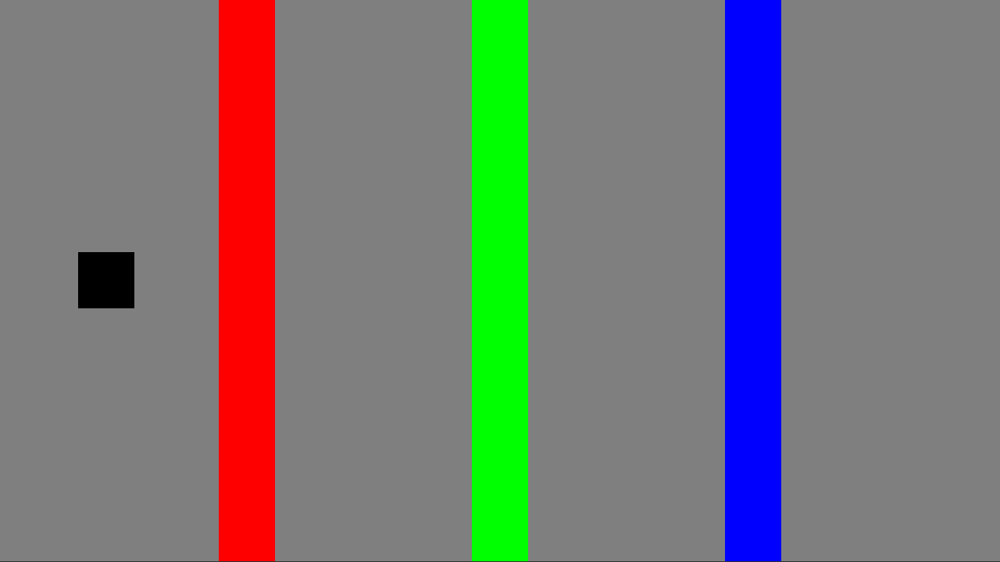

  
  Protótipo de Mecânica: [HUE](https://www.huethegame.com/)

## 📑 Indíce

- [📜 Sobre](#-sobre)
- [💻 Tecnologias](#-tecnologias)

## 📜 Sobre

Protótipo de implementação da mecânica principal do jogo [HUE](https://www.huethegame.com/). No jogo, os obstáculos da mesma cor do ambiente desaparecem permitindo a passagem do jogador.

## 💻 Tecnologias

- C#
- Unity ([LTS 2019.4.1f1](https://unity3d.com/pt/unity/qa/lts-releases?version=2019.4))

---

  
Desenvolvido por 🤘 Diego Moreira
   
  
  
  </a>

